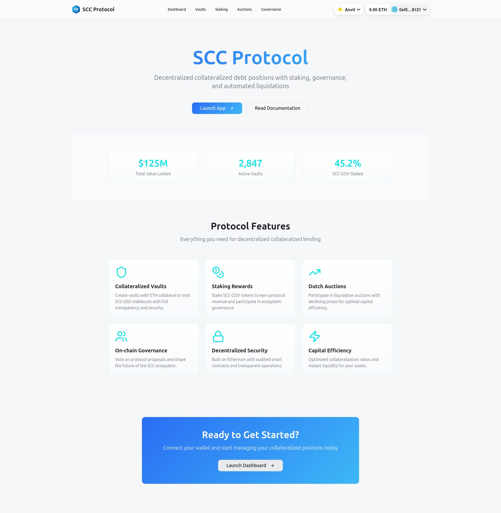

# SCC Stablecoin Protocol

This is the monorepo for the development of **SCC (Crypto-Collateralized Stablecoin)**, a decentralized stablecoin pegged to the dollar and over-collateralized by crypto assets.

## Overview

The SCC Protocol allows users to deposit crypto assets as collateral in `Vaults` to mint the `SCC-USD` stablecoin. The system includes liquidation mechanisms via Dutch Auctions, a governance token (`SCC-GOV`) for community participation, and off-chain services (Keeper Bot, Subgraph) for automation and data indexing.



## Monorepo Structure

The project is organized with `pnpm workspaces` and includes the following main components:

*   `/contracts`: Smart contracts in Solidity (Foundry).
*   `/offchain`: Off-chain services (bots, keepers) in TypeScript/Node.js.
*   `/frontend`: User interface (DApp) to interact with the protocol.
*   `/subgraph`: Blockchain data indexing service (The Graph).
*   `/docs`: Complete project documentation.

## Local Development Environment

We use Docker Compose to orchestrate a complete and integrated development environment, including a local blockchain (Anvil), the indexer (The Graph), and all support services.

To start the environment:

```bash
docker compose up -d
```

To check and test the environment (contract deployment, subgraph, and execution of integration tests):

```bash
pnpm test:integration
```

To stop the environment:

```bash
docker compose down
```

## Dive into the Documentation

For a detailed understanding of the architecture, mechanisms, tokenomics, testing workflow, and more, refer to the [complete project documentation](./docs/README.md).
