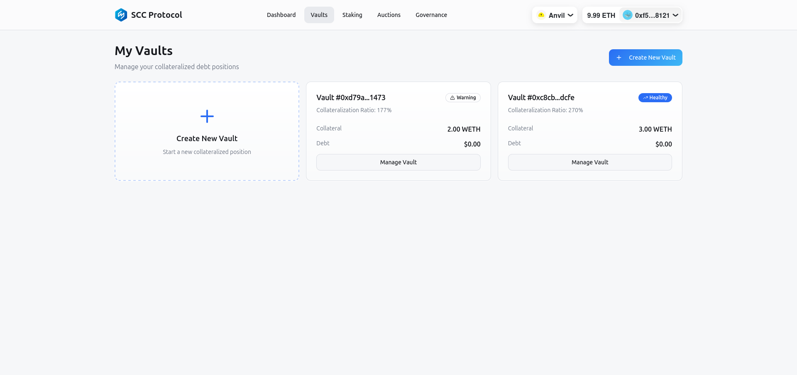
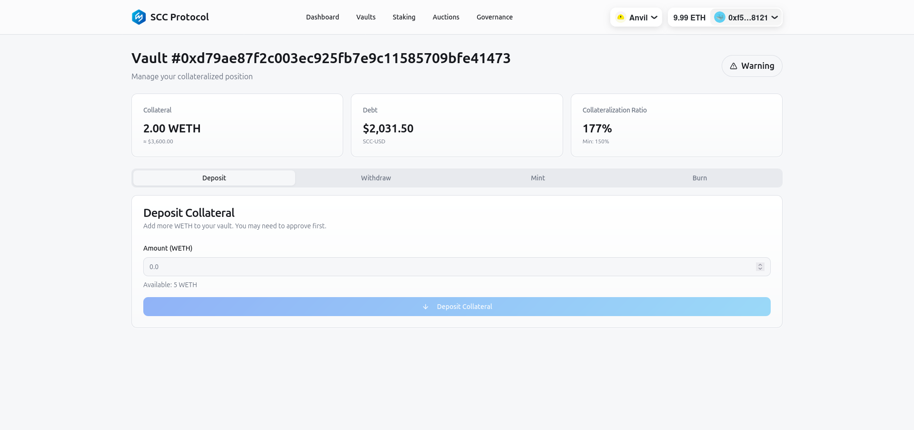
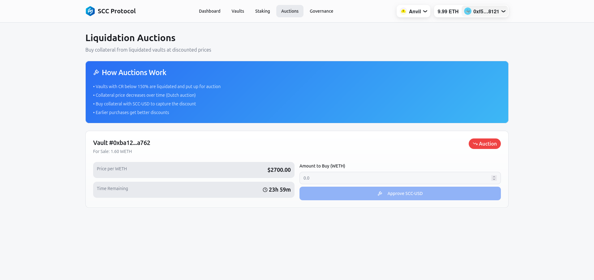

# 2. Guia do Usuário do Protocolo SCC

Este guia detalha como os usuários podem interagir com o Protocolo SCC através da interface de usuário (DApp), cobrindo as principais funcionalidades como criação de Vaults, depósito de colateral, mint de `SCC-USD`, staking de `SCC-GOV`, participação em leilões e governança.

## 2.1. Conectando sua Carteira

Ao acessar o DApp do Protocolo SCC, o primeiro passo é conectar sua carteira Web3 (ex: MetaMask, WalletConnect). Isso permitirá que você interaja com os contratos inteligentes e visualize suas posições.

## 2.2. Dashboard do Protocolo

O Dashboard oferece uma visão geral do estado do protocolo e de suas posições individuais.

*   **Visão Geral do Protocolo:** Exibe métricas chave como Total Value Locked (TVL), Total Debt, Active Vaults e SCC-GOV Staked.
*   **Minhas Posições:** Mostra um resumo dos seus Vaults ativos, posição de staking e recompensas pendentes.

## 2.3. Gerenciando seus Vaults

A seção "Vaults" permite criar e gerenciar suas posições de dívida colateralizada.

### 2.3.1. Criando um Novo Vault

1.  Navegue até a seção "Vaults".
2.  Clique em "Create New Vault".

3.  Confirme a transação em sua carteira para criar o Vault.

### 2.3.2. Depositando Colateral e Mintando SCC-USD

Após criar um Vault, você pode depositar colateral e mintar `SCC-USD`.

1.  Selecione o Vault que deseja gerenciar.
2.  Na tela de gerenciamento do Vault, você verá opções para "Deposit", "Withdraw", "Mint" e "Burn".

3.  **Depositar Colateral:**
    *   Insira a quantidade de colateral (ex: WETH) que deseja depositar.
    *   Clique em "Deposit Collateral" e aprove a transação em sua carteira.
4.  **Mintar SCC-USD:**
    *   Insira a quantidade de `SCC-USD` que deseja mintar.
    *   O sistema calculará o CR resultante. Certifique-se de que ele permaneça acima do mínimo.
    *   Clique em "Mint" e aprove a transação em sua carteira.

## 2.4. Staking de SCC-GOV

A seção "Staking" permite que você faça staking de seus tokens `SCC-GOV` para ganhar recompensas em `SCC-USD` e participar da governança.

1.  **Staking:**
    *   Insira a quantidade de `SCC-GOV` que deseja fazer staking.
    *   Clique em "Stake Tokens" e aprove a transação.
2.  **Reivindicar Recompensas:**
    *   As recompensas acumuladas em `SCC-USD` serão exibidas.
    *   Clique em "Claim Rewards" para transferir as recompensas para sua carteira.

## 2.5. Leilões de Liquidação

Na seção "Auctions", você pode participar de leilões de liquidação para comprar colateral de Vaults sub-colateralizados a um preço com desconto.

1.  Monitore os leilões ativos. O preço do colateral decai com o tempo.
2.  Quando o preço atingir um nível desejado, insira a quantidade de colateral que deseja comprar.
3.  Clique em "Auction" e aprove a transação. Você pagará em `SCC-USD` e receberá o colateral.

## 2.6. Governança do Protocolo

A seção "Governance" permite que os detentores de `SCC-GOV` participem ativamente da tomada de decisões do protocolo.

1.  **Delegar Poder de Voto:** Se você possui `SCC-GOV`, pode delegar seu poder de voto a si mesmo ou a outro endereço.
2.  **Propostas Ativas:** Visualize as propostas de governança ativas.
3.  **Votar:** Vote "For", "Against" ou "Abstain" em propostas para influenciar o futuro do protocolo.
