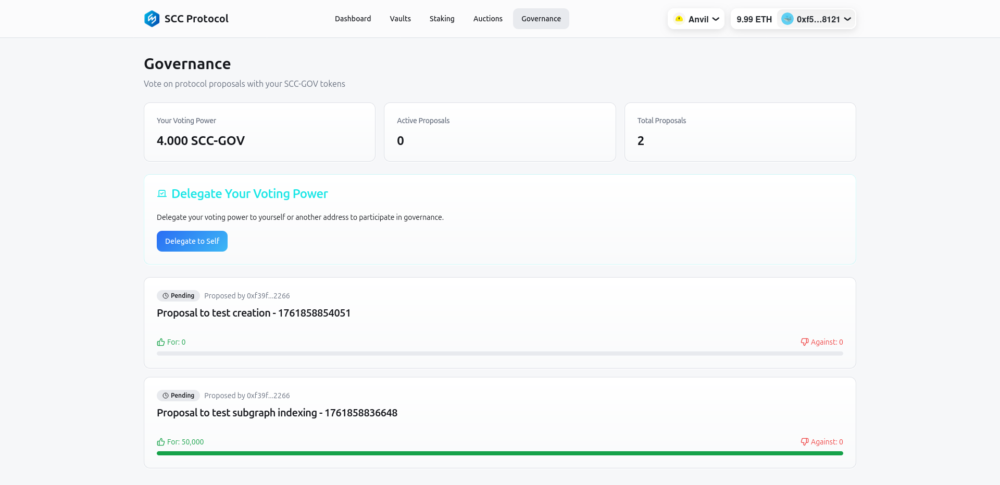

# 2. SCC Protocol User Guide

This guide details how users can interact with the SCC Protocol through the user interface (DApp), covering key functionalities such as creating Vaults, depositing collateral, minting `SCC-USD`, staking `SCC-GOV`, participating in auctions, and governance.

## 2.1. Connecting Your Wallet

When accessing the SCC Protocol DApp, the first step is to connect your Web3 wallet (e.g., MetaMask, WalletConnect). This will allow you to interact with smart contracts and view your positions.

## 2.2. Protocol Dashboard

The Dashboard provides an overview of the protocol's state and your individual positions.

*   **Protocol Overview:** Displays key metrics such as Total Value Locked (TVL), Total Debt, Active Vaults, and SCC-GOV Staked.
*   **My Positions:** Shows a summary of your active Vaults, staking position, and pending rewards.

## 2.3. Managing Your Vaults

The "Vaults" section allows you to create and manage your collateralized debt positions.

### 2.3.1. Creating a New Vault

1.  Navigate to the "Vaults" section.
2.  Click "Create New Vault".

3.  Confirm the transaction in your wallet to create the Vault.

### 2.3.2. Depositing Collateral and Minting SCC-USD

After creating a Vault, you can deposit collateral and mint `SCC-USD`.

1.  Select the Vault you wish to manage.
2.  On the Vault management screen, you will see options for "Deposit", "Withdraw", "Mint", and "Burn".

3.  **Deposit Collateral:**
    *   Enter the amount of collateral (e.g., WETH) you wish to deposit.
    *   Click "Deposit Collateral" and approve the transaction in your wallet.
4.  **Mint SCC-USD:**
    *   Enter the amount of `SCC-USD` you wish to mint.
    *   The system will calculate the resulting CR. Ensure it remains above the minimum.
    *   Click "Mint" and approve the transaction in your wallet.

## 2.4. Staking SCC-GOV

The "Staking" section allows you to stake your `SCC-GOV` tokens to earn rewards in `SCC-USD` and participate in governance.

1.  **Staking:**
    *   Enter the amount of `SCC-GOV` you wish to stake.
    *   Click "Stake Tokens" and approve the transaction.
2.  **Claim Rewards:**
    *   Accumulated `SCC-USD` rewards will be displayed.
    *   Click "Claim Rewards" to transfer the rewards to your wallet.

## 2.5. Liquidation Auctions

In the "Auctions" section, you can participate in liquidation auctions to buy collateral from under-collateralized Vaults at a discounted price.

1.  Monitor active auctions. The collateral price decays over time.
2.  When the price reaches a desired level, enter the amount of collateral you wish to buy.
3.  Click "Auction" and approve the transaction. You will pay in `SCC-USD` and receive the collateral.

## 2.6. Protocol Governance

The "Governance" section allows `SCC-GOV` holders to actively participate in the protocol's decision-making.

1.  **Delegate Voting Power:** If you own `SCC-GOV`, you can delegate your voting power to yourself or another address.
2.  **Active Proposals:** View active governance proposals.
3.  **Vote:** Vote "For", "Against", or "Abstain" on proposals to influence the future of the protocol.
