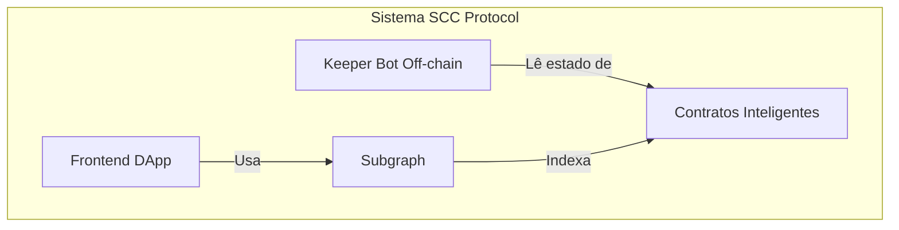
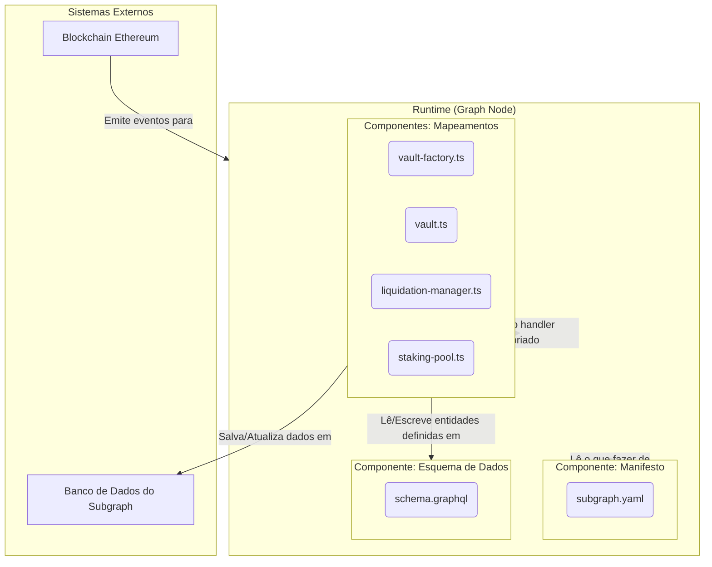

# Arquitetura do Subgraph - Modelo C4

**Status:** Em Andamento

Este documento descreve a arquitetura do Subgraph do SCC Protocol utilizando uma representação textual do modelo C4. O objetivo é clarificar os limites, responsabilidades e interações dos componentes do sistema de indexação.

---

## Nível 1: Contexto do Sistema

O primeiro diagrama mostra o contexto geral, onde o **Sistema de Subgraph** se encaixa no ecossistema do SCC Protocol. Ele não é um sistema isolado, mas uma peça que serve dados para usuários e outras partes do sistema.

```mermaid
graph TD
    subgraph User[Usuário do DApp]
    subgraph DApp[Frontend DApp]
    subgraph Subgraph[Sistema do Subgraph SCC]
    subgraph Blockchain[Blockchain Ethereum]

    User -- "Usa" --> DApp
    DApp -- "Consulta dados (GraphQL)" --> Subgraph
    Subgraph -- "Indexa eventos de" --> Blockchain
```

**Atores e Sistemas:**

-   **Usuário do DApp:** O usuário final que interage com o protocolo através da interface web.
-   **Frontend DApp:** A aplicação de frontend (React/Vue/etc.) que consome os dados do Subgraph para exibir informações sobre Vaults, liquidações, etc.
-   **Sistema do Subgraph SCC (Nosso Foco):** O sistema responsável por indexar dados da blockchain e servi-los via uma API GraphQL.
-   **Blockchain Ethereum:** A fonte da verdade. Contém os contratos inteligentes do SCC Protocol que emitem os eventos a serem indexados.

---

## Nível 2: Containers

O Nível 2 focaria nos "containers" (aplicações ou serviços) dentro do sistema SCC Protocol. O próprio Subgraph é um desses containers. Para contextualizar:



A partir de agora, daremos um "zoom in" no container **Subgraph**.

---

## Nível 3: Componentes do Subgraph

Este é o nível mais importante para a nossa documentação. Ele detalha os componentes internos do nosso **Sistema de Subgraph** e como eles interagem. A execução é orquestrada por um serviço externo (Graph Node).



### Descrição dos Componentes:

1.  **Componente: Manifesto (`subgraph.yaml`)**
    -   **Responsabilidade:** É o cérebro declarativo do Subgraph. Define quais contratos monitorar (`dataSources`), quais eventos escutar (`eventHandlers`), os endereços dos contratos, o bloco inicial de indexação e quais arquivos de mapeamento executar para cada evento.

2.  **Componente: Esquema de Dados (`schema.graphql`)**
    -   **Responsabilidade:** Define a estrutura dos dados que serão armazenados e servidos pela API GraphQL. Funciona como o modelo de dados ou a camada de ORM do Subgraph, definindo as `Entities` (ex: `Vault`, `User`) e seus campos.

3.  **Componentes: Mapeamentos (`src/mappings/*.ts`)**
    -   **Responsabilidade:** Contêm a lógica de negócio da indexação. São arquivos AssemblyScript/TypeScript que transformam os dados brutos de um evento da blockchain em entidades estruturadas (conforme o `schema.graphql`).
    -   **`vault-factory.ts`:** Responsável por "nascer" novas entidades. Escuta o evento `VaultCreated` e cria as entidades `Vault` e `User` iniciais, além de iniciar a indexação dinâmica do novo Vault (template).
    -   **`vault.ts`:** Lida com os eventos de um Vault individual. Atualiza os campos `collateralAmount` e `debtAmount` e cria um registro histórico (`VaultUpdate`) para cada operação.
    -   **`liquidation-manager.ts`:** Rastreia o ciclo de vida de leilões, criando e atualizando a entidade `LiquidationAuction` conforme os eventos `AuctionStarted`, `AuctionBought` e `AuctionClosed` ocorrem.
    -   **`staking-pool.ts`:** Gerencia os dados de staking, atualizando as posições dos usuários (`StakingPosition`) e registrando os pagamentos de recompensas (`RewardEvent`).

---

## Nível 4: Código

Este nível não é representado visualmente, pois corresponde ao código-fonte de cada componente. Por exemplo, um "zoom in" no componente `vault.ts` nos levaria a inspecionar as funções `handleCollateralDeposited`, `handleSccUsdMinted`, etc., e a lógica de transformação de dados dentro delas.
