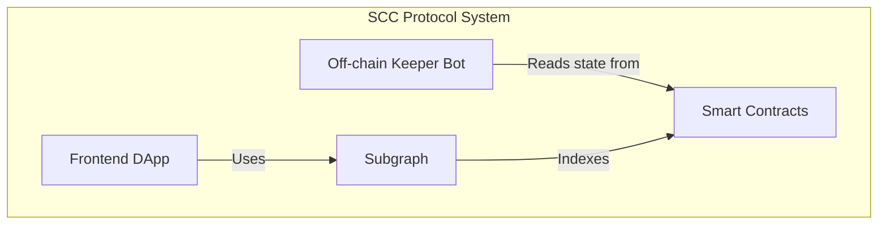
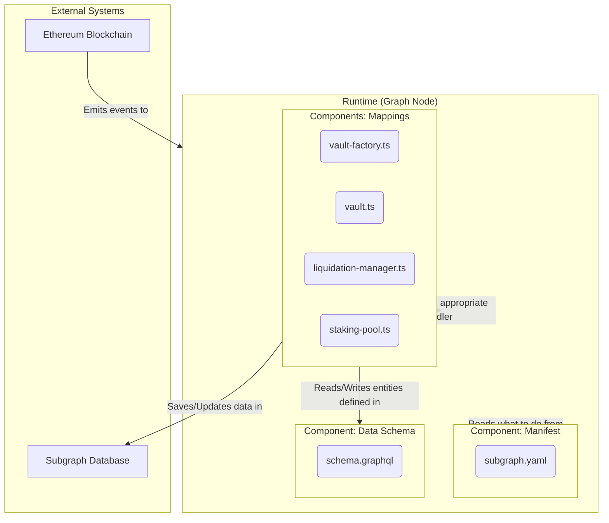

# Subgraph Architecture - C4 Model

**Status:** In Progress

This document describes the architecture of the SCC Protocol Subgraph using a textual representation of the C4 model. The objective is to clarify the boundaries, responsibilities, and interactions of the indexing system components.

---

## Level 1: System Context

The first diagram shows the general context, where the **Subgraph System** fits into the SCC Protocol ecosystem. It is not an isolated system, but a piece that serves data to users and other parts of the system.

```mermaid
graph TD
    subgraph User[DApp User]
    subgraph DApp[Frontend DApp]
    subgraph Subgraph[SCC Subgraph System]
    subgraph Blockchain[Ethereum Blockchain]

    User -- "Uses" --> DApp
    DApp -- "Queries data (GraphQL)" --> Subgraph
    Subgraph -- "Indexes events from" --> Blockchain
```

**Actors and Systems:**

-   **DApp User:** The end-user who interacts with the protocol through the web interface.
-   **Frontend DApp:** The frontend application (React/Vue/etc.) that consumes data from the Subgraph to display information about Vaults, liquidations, etc.
-   **SCC Subgraph System (Our Focus):** The system responsible for indexing blockchain data and serving it via a GraphQL API.
-   **Ethereum Blockchain:** The source of truth. Contains the SCC Protocol smart contracts that emit the events to be indexed.

---

## Level 2: Containers

Level 2 would focus on the "containers" (applications or services) within the SCC Protocol system. The Subgraph itself is one of these containers. To contextualize:



From now on, we will "zoom in" on the **Subgraph** container.

---

## Level 3: Subgraph Components

This is the most important level for our documentation. It details the internal components of our **Subgraph System** and how they interact. Execution is orchestrated by an external service (Graph Node).



### Component Description:

1.  **Component: Manifest (`subgraph.yaml`)**
    -   **Responsibility:** It is the declarative brain of the Subgraph. Defines which contracts to monitor (`dataSources`), which events to listen to (`eventHandlers`), contract addresses, the initial indexing block, and which mapping files to execute for each event. This is where the network (e.g., `localhost`, `mainnet`) and contract addresses are configured.

2.  **Component: Data Schema (`schema.graphql`)**
    -   **Responsibility:** Defines the structure of the data that will be stored and served by the GraphQL API. It functions as the data model or the ORM layer of the Subgraph, defining the `Entities` (e.g., `Vault`, `User`) and their fields.

3.  **Components: Mappings (`src/mappings/*.ts`)**
    -   **Responsibility:** Contain the indexing business logic. They are AssemblyScript/TypeScript files that transform raw blockchain event data into structured entities (according to `schema.graphql`).
    -   **`vault-factory.ts`:** Responsible for "birthing" new entities. Listens for the `VaultCreated` event and creates the initial `Vault` and `User` entities, in addition to starting the dynamic indexing of the new Vault (template).
    -   **`vault.ts`:** Handles events from an individual Vault. Updates the `collateralAmount` and `debtAmount` fields and creates a historical record (`VaultUpdate`) for each operation.
    -   **`liquidation-manager.ts`:** Tracks the lifecycle of auctions, creating and updating the `LiquidationAuction` entity as `AuctionStarted`, `AuctionBought` and `AuctionClosed` events occur.
    -   **`staking-pool.ts`:** Manages staking data, updating user positions (`StakingPosition`) and recording reward payments (`RewardEvent`).

---

## Level 4: Code

This level is not visually represented, as it corresponds to the source code of each component. For example, a "zoom in" on the `vault.ts` component would lead us to inspect the `handleCollateralDeposited`, `handleSccUsdMinted`, etc., functions and the data transformation logic within them.